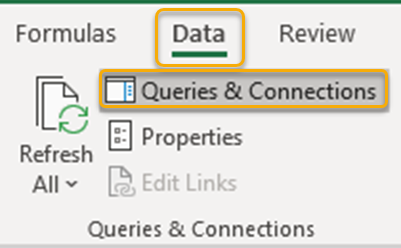
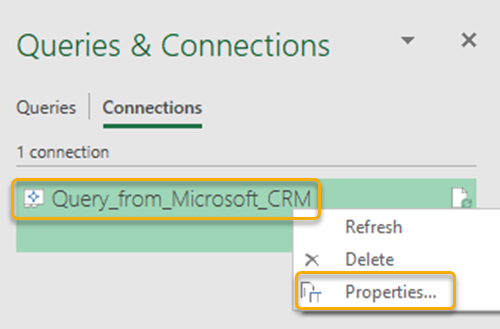
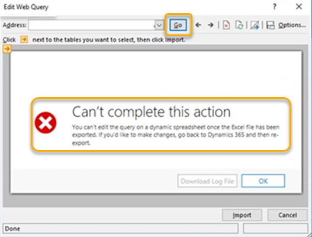

# Troubleshoot export to Excel

## Data disappears after I refresh the exported dynamic Excel file

**Problem**

After I use the **Export to Excel** command to export a file to my local computer, I open the file and select **Refresh All** under **Data**. The data disappears and workbook appears blank.

**Resolution**

This issue occurs when the data that you're accessing is password-protected and the Excel file can't submit passwords to external data sources. To resolve this issue, you must edit and save the web query.

1. In the Excel file, select **Data** > **Queries and Connections**.

    > [!div class="mx-imgBorder"]
    > 

    The **Queries & Connections** pane opens on the right of the window.

    > [!div class="mx-imgBorder"]
    > 

2. On the **Connections** tab, right-click to select the **Query_from_Microsoft_CRM** query, and then select **Properties**.

    > [!div class="mx-imgBorder"]
    > 

    The **Connection Properties** window opens.

3. On the **Definition** tab, select **Edit Query**.

    > [!div class="mx-imgBorder"]
    > 

4. When prompted, enter username and password.   

5. If the following error message appears, close the **Edit Web Query** window.   

    > [!div class="mx-imgBorder"]
    >     

6. Refresh the data in Excel.

[!INCLUDE[footer-include](../includes/footer-banner.md)]