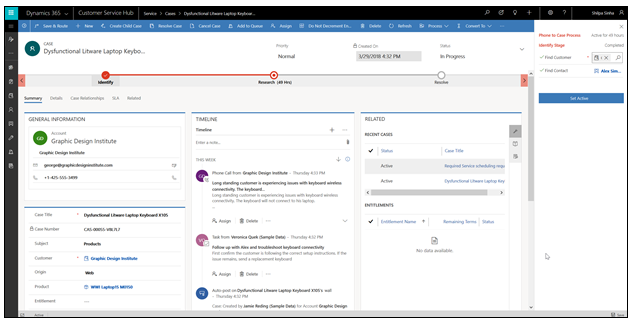

#  Enhanced user experience with the Unified Interface for model-driven apps 

The Unified Interface for model-driven apps provides a consistent and accessible user experience across devices—whether on a desktop, laptop, tablet, or phone. The apps scale by reflowing the components on the screen. The responsive design adapts to your environment based on screen size, so the more available space that you have, the more information can be displayed.

> [!div class="mx-imgBorder"]
> 

## Navigation

The menu options let you swiftly navigate the different apps in the system. They provide quick access to recently viewed records and pinned favorites. 

> [!div class="mx-imgBorder"]
> 

1. Site map is expanded and persists by default.
2. The subarea that you are currently in is highlighted to indicate where in the app.
3. **Recent** and **Pinned** items are at the top for easy access. 
4. Use the Area switcher to switch between apps.
5. Icons have unique colors on the command bar to show differentiation between commands.

For more information, see [Basic navigation in a model-driven app](navigation.md).

## Dashboards and charts
You can access all the system and user dashboards from within your Unified Interface apps. The interactive dashboards are now available for all record types with richer interactive dashboard capabilities. For more information, see [Track your progress with dashboards and charts](track-your-progress-with-dashboard-and-charts.md).

## Timeline control 
The timeline view helps you collaborate with your team by tracking customer communication in a record on a single page in an easy-to-read view. You can see everything from posts and voice attachments, to emails and notes. It provides a quick way to see the entire communication thread. For more information, see [Add an appointment, email, phone call, notes or task activity to the timeline](add-activities.md).

## Business process 
The business process flow has been improved by the docking mechanism. You can dock the business process stage on your screen to help you stay focused on the task at hand in your business process flow. This is especially useful when the stage of the process has complex steps to complete. For more information, see [Work with business processes](work-with-business-processes.md).

## Accessibility
The improved accessibility experience lets you use screen readers to translate on-screen information into audible sound and print to a Braille reader so that more people can use the app. For more information, see [Use a screen reader](screen-reader.md).
