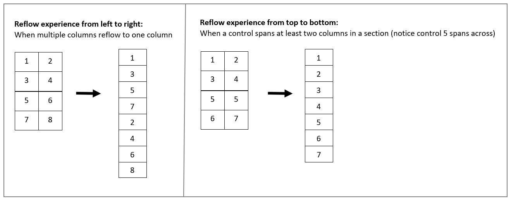

# Enhanced user experience with the Unified Interface for model-driven apps 

The Unified Interface for model-driven apps provides a consistent and accessible user experience across devices—whether on a desktop, laptop, tablet, or phone. The apps scale by reflowing the components on the screen. The responsive design adapts to your environment based on screen size, so the more available space that you have, the more information can be displayed.

> [!div class="mx-imgBorder"]
> 

For an overview of Unified Interface in model-driven apps, watch this video: [Introduction to Unified Interface](https://www.youtube.com/watch?v=_VPOi_Iq6ko)

> [!NOTE]
> The legacy web client will be deprecated and customers must transition to Unified Interface before October 1, 2020. For more information, see [Blog: Announcing the timeline to move to Unified Interface](https://cloudblogs.microsoft.com/dynamics365/it/2019/09/10/announcing-the-timeline-to-move-to-unified-interface/). To learn more on how to transition, see [Quick start for transitioning](https://docs.microsoft.com/powerapps/maker/model-driven-apps/transition-web-app).

## Navigation

The menu options let you swiftly navigate the different apps in the system. They provide quick access to recently viewed records and pinned favorites.

Legend:

1. **App selector**: Open this menu to move between apps.
1. **Collapse/expand button**: Select this to collapse the navigator to allow more room for the main part of the page. If the navigator is already collapsed, select this button to expand it again.
1. **Recent records**: Expand this entry to view a list of records you were recently using. Select an record here to open it. Select the push-pin icon next to a record listed here to added to your favorites (pinned records).
1. **Favorite records**: Expand this entry to view and open your favorite (pinned) records. Use the **Recent records** list to add records here. Select the remove-pin icon next to a record listed here to remove it from this list.
1. **Entity navigator**: This area lists each entity and dashboard available for the current work area. Select any entry here to open the named dashboard or list-view for that entity.
1. **Work-area selector**: Open this menu to move to another work area. The current work area is named here.

For more information, see [Basic navigation in a model-driven app](navigation.md).

## Dashboards and charts
You can access all the system and user dashboards from within your Unified Interface apps. The interactive dashboards are now available for all record types with richer interactive dashboard capabilities. For more information, see [Track your progress with dashboards and charts](track-your-progress-with-dashboard-and-charts.md).

## Timeline control 
The timeline view helps you collaborate with your team by tracking customer communication in a record on a single page in an easy-to-read view. You can see everything from posts and voice attachments, to emails and notes. It provides a quick way to see the entire communication thread. For more information, see [Add an appointment, email, phone call, notes or task activity to the timeline](add-activities.md).

## Business process 
The business process flow has been improved by the docking mechanism. You can dock the business process stage on your screen to help you stay focused on the task at hand in your business process flow. This is especially useful when the stage of the process has complex steps to complete. For more information, see [Work with business processes](work-with-business-processes.md).

## Accessibility
The improved accessibility experience lets you use screen readers to translate on-screen information into audible sound and print to a Braille reader so that more people can use the app. For more information, see [Use a screen reader](screen-reader.md).

## Create a Unified Interface app
If you have requirements to create your own experience on Unified Interface, you can create a model-driven app using the app designer. See [Overview of building model-driven apps](https://docs.microsoft.com/powerapps/maker/model-driven-apps/model-driven-app-overview).

## Unified Interface Community

Go to the [Unified Interface Community site](https://community.dynamics.com/365/unified-interface/) to get help with planning and executing a smooth transition to the Unified Interface and engage with experts and peers on blogs, webinars, videos, events, and more.
