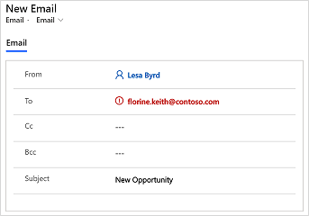
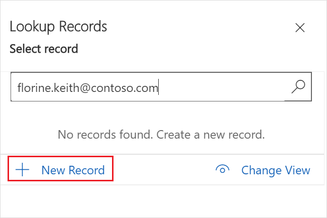
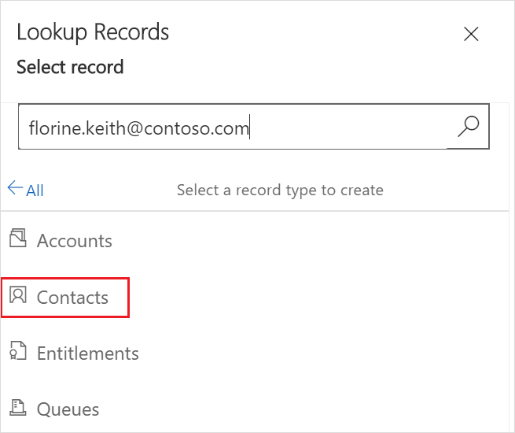
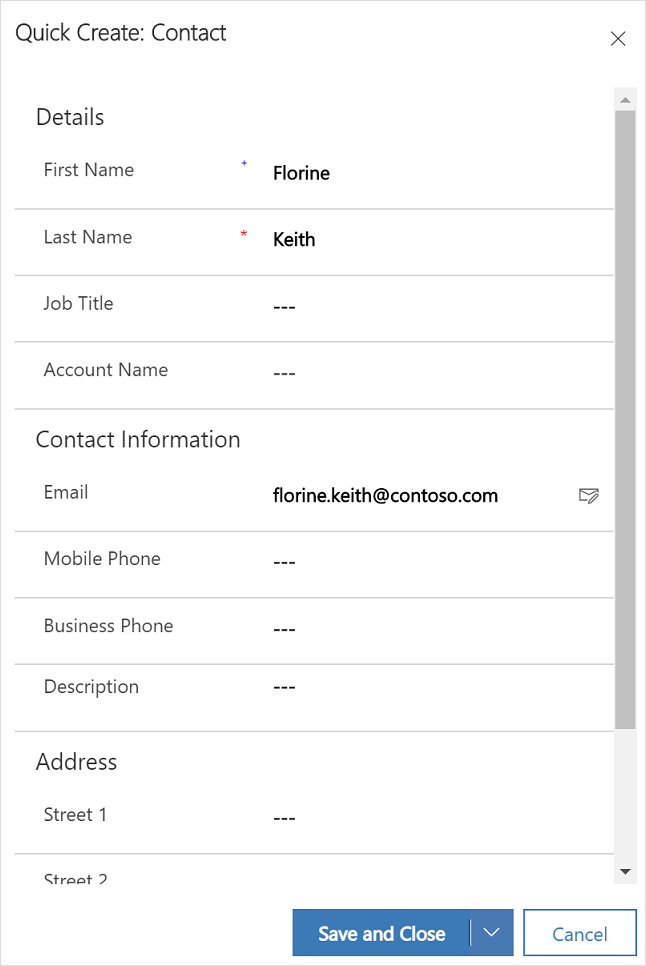
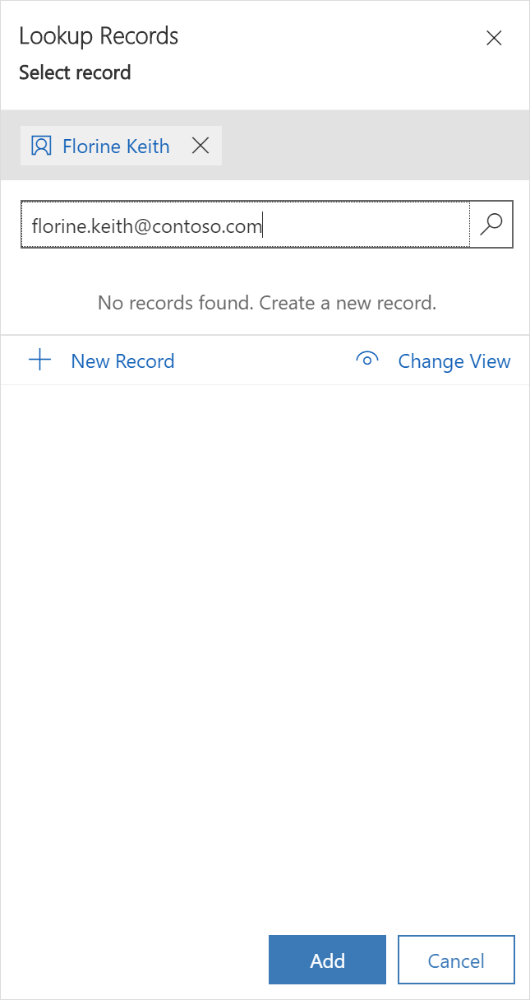
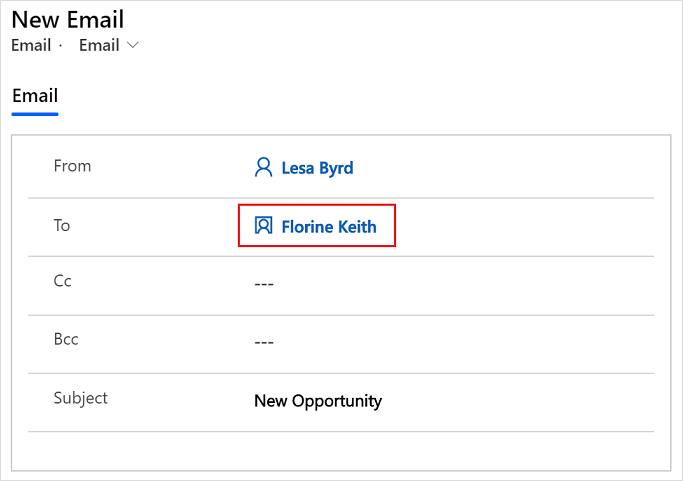

# Resolve an unresolved email recipient

An *unresolved email recipient* is one whose email address isn't associated with any table rows in Microsoft Dataverse. By default, you can't send an email to an unresolved email recipient. If you enter an unresolved email recipient address, the email address is deleted as soon as you move the focus out of the **To**, **Cc**, or **Bcc** column. An administrator must enable the unresolved email recipient feature by selecting **Yes** for **Allow messages with unresolved email recipients to be sent** on the **Email** tab in the **System Settings** dialog box. More information: [System Settings Email tab](/power-platform/admin/system-settings-dialog-box-email-tab)

After the feature is enabled, you can add an unresolved email recipient in the **To**, **Cc**, or **Bcc** column. The entered email address is shown in red. You can then select the email address and associate it with a table row in Dataverse without navigating away from the email form.

If you receive an email that has email addresses that aren't associated with a table row, the email addresses are shown in red. You can then individually select the email addresses and associate them with a table row. You can then send emails to the newly added email addresses.

**To resolve an unresolved email recipient**

1. Open the email editor and select the unresolved email recipient.

    

2. In the **Lookup Rows** pane, select **New Row**.

    

    > [!NOTE]
    > If rows are displayed in search results, you can resolve the email to one of the existing rows.

3. Select the row type to create. For example, **Contacts**.

    

4. In the **Quick Create: Contact** pane, enter the required details, and select **Save and Close**.

    

5. The contact is created and selected in the **Lookup Rows** pane. Select **Add**.

    

6. The unresolved email recipient is resolved and shown in the **To** column in the email editor.

    

### See also

[Allow unresolved email recipients](/power-platform/admin/system-settings-dialog-box-email-tab)

[!INCLUDE[footer-include](../includes/footer-banner.md)]