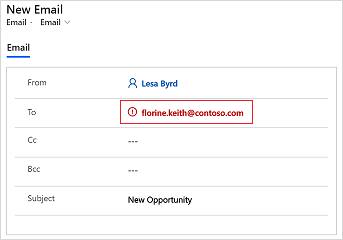

# Send email to unresolved email recipients

An unresolved email recipient is one whose email address does not get resolved to a contact. By default, you cannot send an email to an unresolved email recipient. If you enter an unresolved email recipient, the email address is deleted as soon as you move the focus out of the **To** field. An administrator must enable the unresolved email recipient feature by selecting **Yes** for **Allow messages with unresolved email recipients to be sent** on the **Email** tab in the **System Settings** dialog box. More information: [System Settings Email tab](https://docs.microsoft.com/power-platform/admin/system-settings-dialog-box-email-tab)

After enabling the feature, when you enter an unresolved email recipient in the **To** field, the email address is shown in red. You can then select the email address, save it to Common Data Service, and then send the email.

**To send email to unresolved email recipients**

1. Open the email editor.

2. Select the unresolved email recipient. 

    

3. In the **Lookup Records** pane, select **New Record**.

    

4. Select the record type to create. For example, **Contacts**.

    

5. In the **Quick Create: Contact** pane, enter the required details, and select **Save and Close**.

    

6. The contact is created and selected in the **Lookup Records** pane. Select **Add**.

    

7. The unresolved email recipient is resolved and shown in the **To** field in the email editor.

    

### See also

[Allow unresolved email recipients](https://docs.microsoft.com/power-platform/admin/system-settings-dialog-box-email-tab)
