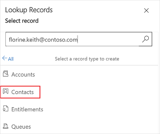

# Resolve an unresolved email recipient

An *unresolved email recipient* is one whose email address isn't associated with any entity records in Common Data Service. By default, you can't send an email to an unresolved email recipient. If you enter an unresolved email recipient address, the email address is deleted as soon as you move the focus out of the **To**, **Cc**, or **Bcc** field. An administrator must enable the unresolved email recipient feature by selecting **Yes** for **Allow messages with unresolved email recipients to be sent** on the **Email** tab in the **System Settings** dialog box. More information: [System Settings Email tab](https://docs.microsoft.com/power-platform/admin/system-settings-dialog-box-email-tab)

After the feature is enabled, you can add an unresolved email recipient in the **To**, **Cc**, or **Bcc** field. The entered email address is shown in red. You can then select the email address and associate it with an entity record in Common Data Service without navigating away from the email form.

If you receive an email that has email addresses that aren't associated with an entity record, the email addresses are shown in red. You can then individually select the email addresses and associate them with an entity record. You can then send emails to the newly added email addresses.

> [!NOTE]
> You can also resolve emails to existing records.

**To resolve an unresolved email recipient**

1. Open the email editor and select the unresolved email recipient.

    

2. In the **Lookup Records** pane, select **New Record**.

    

3. Select the record type to create. For example, **Contacts**.

    

4. In the **Quick Create: Contact** pane, enter the required details, and select **Save and Close**.

    

5. The contact is created and selected in the **Lookup Records** pane. Select **Add**.

    

6. The unresolved email recipient is resolved and shown in the **To** field in the email editor.

    

### See also

[Allow unresolved email recipients](https://docs.microsoft.com/power-platform/admin/system-settings-dialog-box-email-tab)
