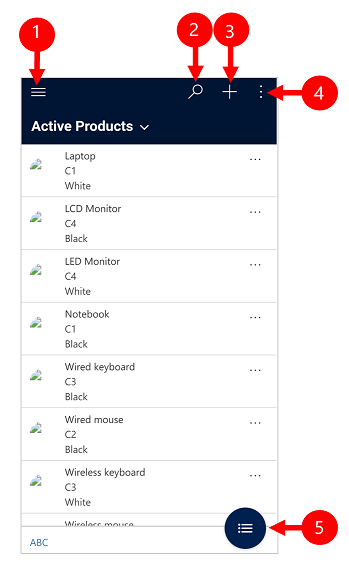
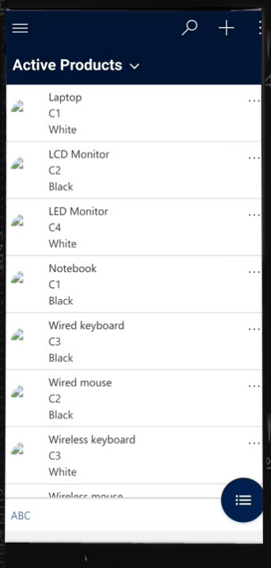
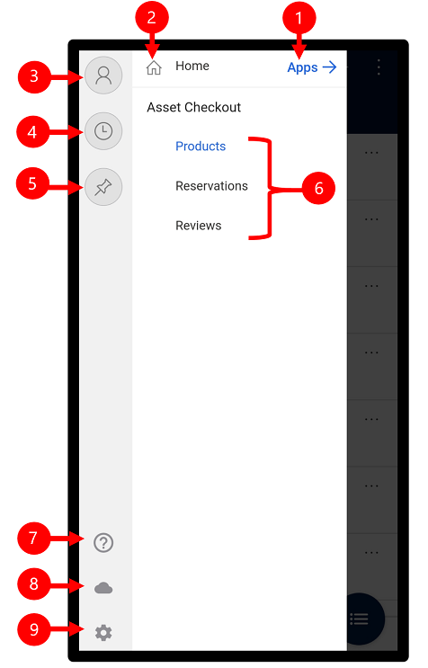
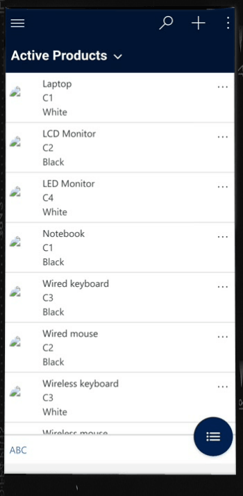
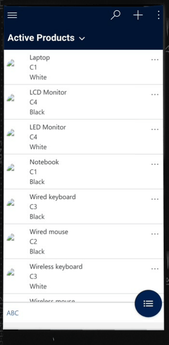

# User Guide for model-driven apps

This is an early-access feature. You can opt in early to enable these features in your environment. This will allow you to test these features and then adopt them across your environments. For information on how to enable these features, see [Opt in to 2020 release wave 1 updates](https://docs.microsoft.com/power-platform/admin/opt-in-early-access-updates).

Use the Power Apps mobile app to run model-driven apps on your mobile device. 

For more information on how to install and get started with the app, see [Run canvas app and a model-driven app on a mobile device](run-app-client.md).

> [!IMPORTANT]
> Model-driven apps for sales, customer service, and field service don't run in the Power Apps mobile app. Instead, you use the Dynamics 365 for phones and tablets app. For more information, see [User Guide for Dynamics 365 for phones and tablets](https://docs.microsoft.com/dynamics365/mobile-app/dynamics-365-phones-tablets-users-guide).

## Home screen 

It's easy to get around in the Power Apps mobile app. The following illustration shows the primary navigation elements on the Home screen. 

Legend:

1. **Site map**: Open the menu and move between apps, get to your favorite and recently used records, access settings and more.
2. **Search**: Search for app records in Common Data Service.
3. **Quick Create**: Create a new record and quickly enter almost any type of information into the system.
4. **Global commands**: Access global commands customized by your admin.
5. **More**: Access more commands for the record(s) that you're working like sort, search, delete, refresh and more.
6. **Sort records**: Sort and view records alphabetically.

## Site map 

From the Home screen, select the site map  to access entities, favorite or most-used records, other apps, and settings.

   > [!div class="mx-imgBorder"]
   > .

The following illustration shows the primary navigation elements on the site map screen. 

Legend

1. **App selector**: Open this menu to move between apps.
2. **Home screen**: Select this to go back to the Home screen.
3. **Profile**: Go to the Profile screen to sign out or reconfigure the app. 
4. **Recent records**: View a list of records you were recently using. 
5. **Pinned records**: View and open your favorite (pinned) records. 
6. **Entity navigator**: This area lists the entity available in the app.
7. **Help**: Access help content for more information on how to use the Power Apps mobile app.
8. **Offline Status**: Work with your data in offline mode even when you don't have internet access. For more information, see [Work offline on your mobile device](https://docs.microsoft.com/dynamics365/mobile-app/work-in-offline-mode).
9. **Settings**: Access settings.

## Pin favorite records

The **Pinned** and **Recent** provides quick access to your records that you have recently used or pinned to favorites. 
Use the **Recent** records list to pin favorite records.  

1. From the site map  select, **Recent** .

2. On the **Recent** records screen, select the push-pin icon next to a record to add it to your favorites (pinned records).

3. To view the newly pinned records, select  and then select **Pinned** .

   > [!div class="mx-imgBorder"]
   > .

### Unpinn a record

1. From the site map  select, **Pinned** .

2. Select the remove-pin icon  next to a record to remove it from favorites (pinned records).
 
   > [!div class="mx-imgBorder"]
   > .
 
## Change views

- From the Home screen, select the down arrow  next to the current view and then select a new view.

   > [!div class="mx-imgBorder"]
   > .

## Add a record quickly

1. From the Home screen, select **New** .
2. Fill in the fields, and then select **Save**.
3. Once the record is created, you can view the new record. 

   > [!div class="mx-imgBorder"]
   > .

-  To save and open the record that you  created, at the topic right select **More**  and then select **Save and Open**.
- To save and create another record, at the top right select the **More**  and then select **Save and Create new**.

   > [!div class="mx-imgBorder"]
   > .

## View commands for a record

1. From the Home screen, open a record.
2. On the open record, select **More**  to access more commands.

   > [!div class="mx-imgBorder"]
   > .

## Edit a record

1. From the Home screen, open a record that you want to edit. 
2. When you are done editing the record, select **Save**. To cancel your changes, select **Discard**.

   > [!div class="mx-imgBorder"]
   > .
   
   
## Go back 

- To get back to the Home screen when you are in a record, select **Back** .
- At any point, press and hold the **Back**  to go back to the Home screen. 

   > [!div class="mx-imgBorder"]
   > .

