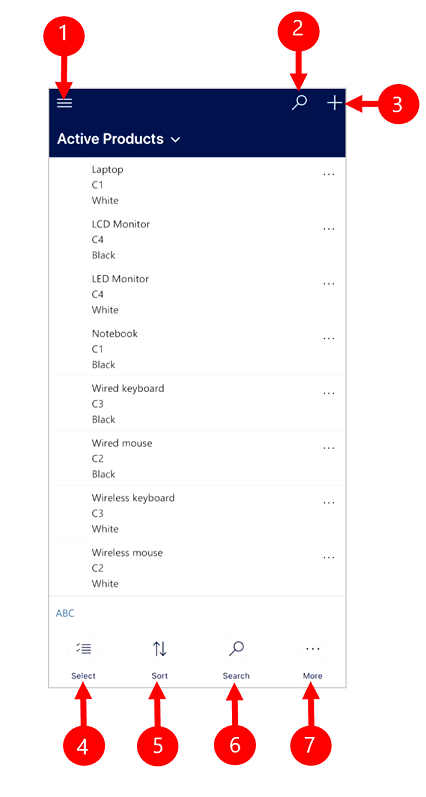
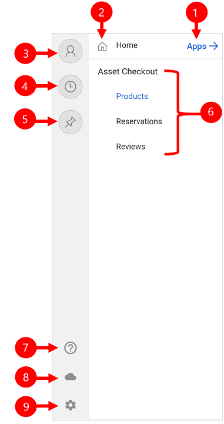

# Use a custom model-driven app on a mobile device

Use the Power Apps mobile app to run your custom model-driven apps on your phone.

## Home screen 

It's easy to get around in the Power Apps mobile app. The following illustration shows the primary navigation elements on the Home screen. 

Legend:

1. **Site map**: Open the menu move between apps, get to your favorite and recently used records, access settings and more.
2. **Search**: Search for app records in Common Data Service.
3. **Quick Create**: Create a new record and quickly enter almost any type of information into the system.
4. **Select**: Select multiple records from the current view.
5. **Sort**: Sort records.
6. **Search**: Search for app records in Common Data Service.
7. **More**: Access more commands.

### Site map 

Use the site map to accces entites, favorite or most-used records. other apps, and settings.

