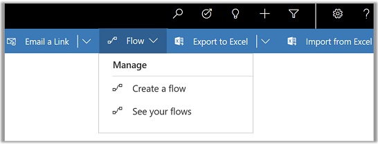

# Use Power Automate to automate processes

Power Automate lets you create automated processes between your favorite apps and services. From within your app, you can run a flow on one or more rows. 

Also, you can open Power Automate from your app to view, edit, or create new flows.  More information: [Get started with Power Automate](/flow/getting-started)

## Manage your flows 
Connect with Power Automate from your app to manage your flows.
  
> [!NOTE]
> To manage and run Power Automate from your app, Power Automate must be enabled in System Settings for you organization. More information:  [Flows in your organization](/flow/organization-q-and-a) 
  
1. On the command bar, select **Flow**.  
  
   > [!div class="mx-imgBorder"]
   >  
  
2. The following options appear:  
  
   -   Select **Create a flow** to open a new browser tab and direct you to the Power Automate site. On the Power Automate page, select **Continue** to use an existing template or **X** to close, choose, or create a different one.  
  
   -   Select **See your flows** to open a new browser tab and direct you to the Power Automate site where any flows in the Flow environment are displayed.  
  
   -   Select **Login to flow** to connect with Power Automate and display available flows for you to run. This only appears if you aren’t currently signed in to Power Automate.   

    For information about creating a flow, see [Get started with Power Automate](../maker/canvas-apps/using-logic-flows.md#create-a-flow)  
    
 
    
  

[!INCLUDE[footer-include](../includes/footer-banner.md)]