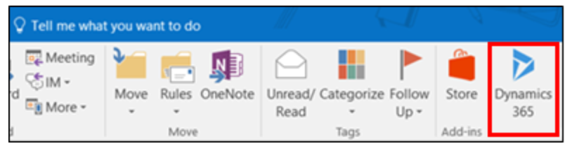

# Use Dynamics 365 App for Outlook

Use Dynamics 365 App for Outlook to manage your app data while using Outlook on the desktop, web, or mobile. You can view information about an email or appointment or link it to a row in your app.

When Dynamics 365 App for Outlook is installed, in the Outlook ribbon select **Dynamics 365** to open the **Dynamics 365** pane next to a selected Outlook email message, or when you're composing an email message or setting up a meeting or appointment.

   > [!div class="mx-imgBorder"] 
   > 

## What Dynamics 365 App for Outlook offers?

With Dynamics 365 App for Outlook, you can:  

- Track your emails and appointments in Outlook and associate them to the right record in your app.

- Synchronize contacts and related information so that Exchange and your app are always up to date.
  
- View information about Dataverse contacts and accounts while you’re working in Outlook. You can view this information in the context of an email message, meeting, or appointment. For example, view phone numbers, company name, last and next activities, and recent rows. 
  
  

For information on using Dynamics 365 App for Outlook, see [Basic navigation in App for Outlook](/dynamics365/customer-engagement/outlook-app/user/basic-navigation).

### See also

[Customize Dynamics 365 App for Outlook](../maker/model-driven-apps/app-for-outlook-customize.md)  

[!INCLUDE[footer-include](../includes/footer-banner.md)]
