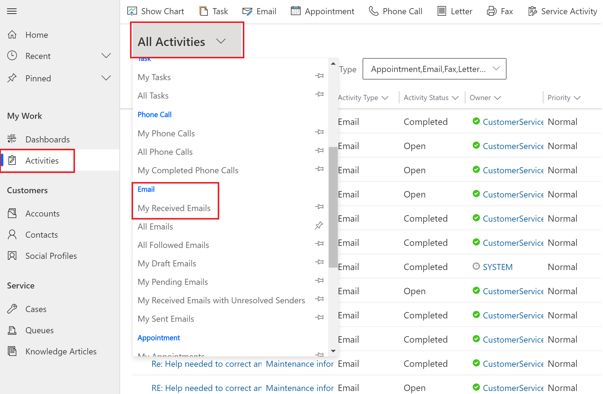
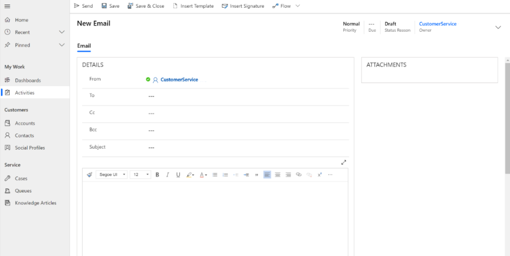
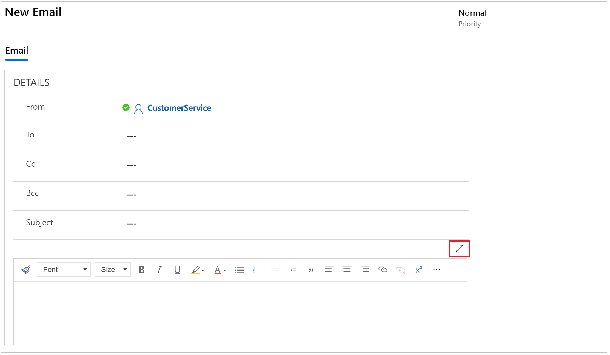
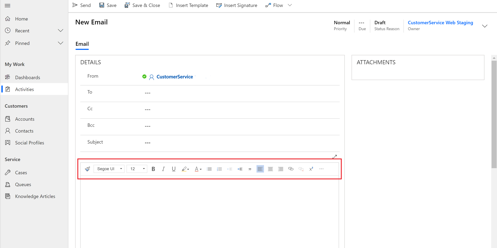

# View and create email through the Activities grid

Dynamics 365 model-driven apps let you interact with customers through email. The email functionality allows you to:

- View and respond to emails. 

- Utilize common email toolbar functionality and rich text editor controls. 

- View and insert images inline using drag-and-drop or copy-and-paste functionality. 

- Create email in a pop-up window.  

- Preview templates before applying them. 

## View your email

To view your email:

1. In the model-driven app's sitemap, select **Activities**. 

2. Select the **All Activities** drop-down, and then select **My Received Emails**.

    

3. Select the email you want to view to open it. The email will open, where you can then reply to the sender and recipients or forward it.

## Create email

The following steps detail how to create an email.

1. In the model-driven app's sitemap, select **Activities**.

2. On the command bar, select **Email**. A new email window opens.

    

    The **From** column is automatically populated based on the currently logged-in user.

3. Write your email directly in the composer or select **Insert Template** to search for and apply a template. For more information on inserting an email template, see [Insert an email template](insert-email-template.md).

4. To compose your email in a full-screen window, select the expand icon.

    

    The message box has a rich text editor that enables you to create rich and well-formatted content for the emails with emphasis. The editor brings common word processor features like: 

    - Copy formatting
    - Font and size
    - Bold, italic, and underline
    - Background color for text and text color
    - Bulleted and numbered list
    - Decrease and increase indent
    - Block quote
    - Text alignment (align left, center, and right)
    - Link and unlink
    - Text strikethrough
    - Image
    - Text direction from right to left and left to right
    - Undo and redo
    - Remove format
    - Table

    

5. When you're done, select **Send**.

## Accessibility shortcuts

The following table outlines a list of accessibility shortcuts available when using email. You can access this list while composing email by pressing **Alt+0**.

|Type | Shortcut key | Description |
|----------------------|-------------------------|-----------------------------|
| General | Alt+F11 | Toggle full-screen view. |
| Tab navigation | Alt+Ctrl+0 | Go to menu bar. |
| Tab navigation | Alt+1 | Go to the rich-text editor. |
| Tab navigation | Alt+2 | Go to the HTML editor. |
| Tab navigation | Alt+3 | Go to the preview view. |
| General editor commands | Alt+F10 | Navigate to the editor toolbar. Move to the next and previous toolbar group with Tab and Shift+Tab. Move to the next and previous toolbar button with Right Arrow or Left Arrow. Press Space or Enter to activate the toolbar button. |
| General editor commands |  | Editor dialog: Inside a dialog, press Tab to navigate to the next dialog element, press Shift+Tab to move to the previous dialog element, press Enter to submit the dialog, press ESC to cancel the dialog. When a dialog has multiple tabs, the tab list can be reached either with Alt+F10 or with Tab, following the dialog tabbing order. With a tab list focused, move to the next and previous tab with Right and Left Arrow, respectively.. |
| General editor commands |  | Editor list box: Inside a list box, move to next list item with Tab or Down Arrow. Move to previous list item with Shift+Tab or Up Arrow. Press Space or Enter to select the list option. Press ESC to close the list box. |
| Base commands | Ctrl+Z | Undo command. |
| Base commands | Shift+Ctrl+Z | Redo command. |
| Base commands | Ctrl+B | Bold command. |
| Base commands | Ctrl+I | Italic command. |
| Base commands | Ctrl+U | Underline command. |
| Base commands | Alt+0 | Accessibility help. |
| Base commands | Esc | Cancel operation. |

### See also

[Set up enhanced email](/power-platform/admin/system-settings-dialog-box-email-tab) 
[Insert an email template](insert-email-template.md)

[!INCLUDE[footer-include](../includes/footer-banner.md)]