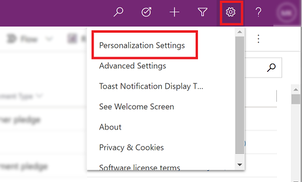
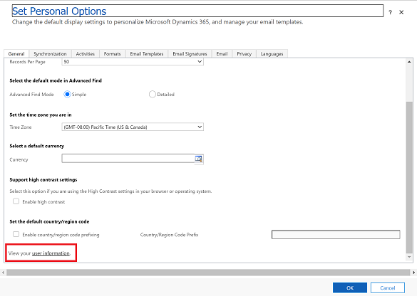
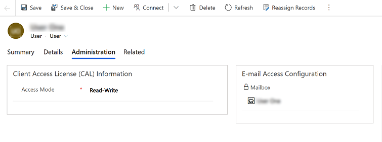

# View your user information  

The user information page displays useful information about you and your organization. On the page you can view your contact information, your security role, and information about your organization. Depending on your security role, you might be able to make changes to your user profile.  
  
1. Open an app and in the upper-right corner of the screen, select **Settings**  > **Personalization Settings**.  

   > [!div class="mx-imgBorder"] 
   > 

2. On the **General** tab, scroll down to the bottom and select the **user information** link.  

   > [!div class="mx-imgBorder"] 
   > 
  
3. On the user information page select the different tabs, such as **Summary**, **Details**, or **Administration** to see details about your profile. 

   > [!div class="mx-imgBorder"] 
   > 
  

[!INCLUDE[footer-include](../includes/footer-banner.md)]
