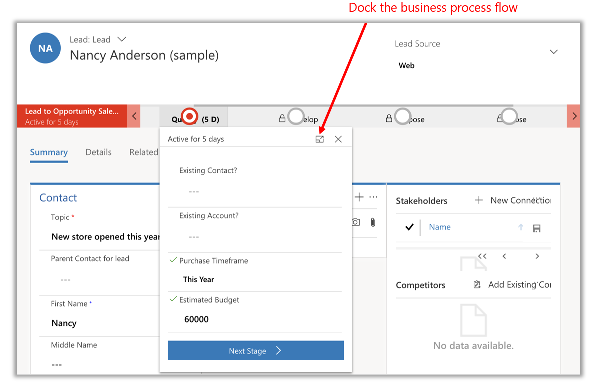
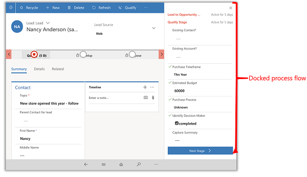

# Work with business processes
   
   
<!--In first sentence, gives step-by-step what - process? guidance? -->

   
The business process bar on forms gives a clear, step-by-step for building customer relationships. You can see at a glance exactly where you are with a customer and what you need to do next.

> [!div class="mx-imgBorder"]
> 
 
The process bar can be docked to the right side of the screen for easy reference as you work with a customer record. 

> [!div class="mx-imgBorder"]
> 
  
 
## What if your business processes look different from these examples?  

The system comes with business processes for common tasks. However, most organizations customize these processes to match the way they do things. Or, you might have added processes to the system that have been customized for your industry or business goals. In other words, what you see here may not exactly match the process bars you see on your system. But regardless, the process bars work the same for everyone. You enter data in the fields, and then move the customer to the next stage.

