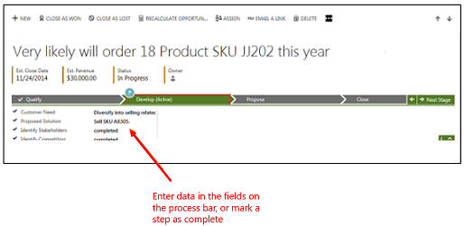

# Work with business processes
  
 Everyone on your team moves customers through standardized business processes with the same stages and steps for each type of customer interaction, collecting and inputting important data along the way. Business processes help everyone follow best practices, even when handling situations that don’t occur very often. You complete a step by entering data or marking the step completed in the process bar at the top of the screen. When all the steps are done, you can move on to the next stage.  
  
 For example, your organization might have a business process to handle a new sales opportunity by first qualifying whether the person has the budget to buy, and then developing the opportunity by talking with a stakeholder. Next, you send a sales proposal, and finally you close the opportunity as won when the customer places the order.  
  
 In this example, the business process bar for new opportunities shows you the four stages to follow (**Qualify**, **Develop**, **Propose**, and **Close**), where you are in the process, and what to do next, so there’s no guesswork.  
  
    
  
## What if your business processes look different from these examples?  
 The system comes with business processes for common tasks. However, most organizations customize these processes to match the way they do things. Or, you may have added processes to the system that have been customized for your industry or business goals. In other words, what you see here may not match exactly with the process bars you see on your system. But regardless, the process bars work the same for everyone. You enter data in the fields, and then move the customer to the next stage.

