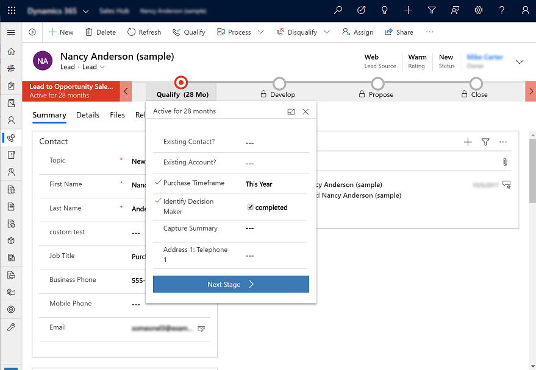
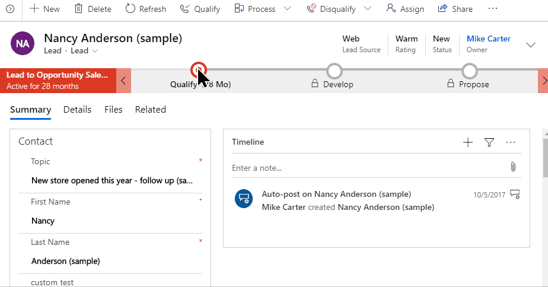

# Work with business processes

Business processes help everyone follow best practices, even for situations that don't occur often. Where available, business processes provide a step-by-step timeline for the stages of a process at the top of the relevant row. You open the menu for the active stage, enter each column of required and business-critical data, and then select the next stage when you're ready to work with it. Some business processes can be completed in the time it takes to make a single phone call, while others might take several weeks.

As you work on a new customer row, the business process flow helps you see each step that you need to take to create the new row and fill out the required information according to your organization's business process. 

  > [!div class="mx-imgBorder"]
  > 

You can also dock the process bar to the right side of the screen for easy reference as you work with a customer row. 

- On the process bar, select a stage, and then select **Pin the stage flyout** . 

  > [!div class="mx-imgBorder"]
  > 
 
  
 
## What if your business processes look different from these examples?  

The system includes business processes for common tasks. However, most organizations customize these processes to match the way they work. You might also add processes that are customized for your industry or business goals. In other words, the process bars you see might not exactly match what you see in your system. Regardless, the process bars work the same for everyone. You enter data in the columns, and then move the customer to the next stage.

For more information about applying custom business logic with business rules and flows, see [Apply custom business logic with business rules and flows in model-driven app](../maker/model-driven-apps/guide-staff-through-common-tasks-processes.md).

[!INCLUDE[footer-include](../includes/footer-banner.md)]
