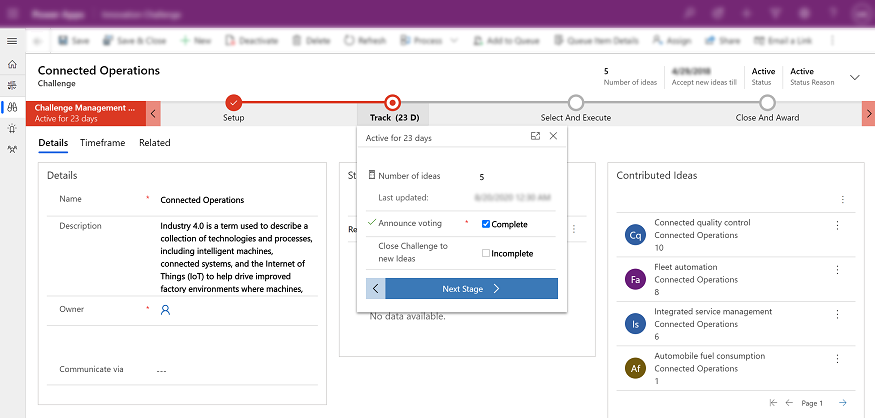
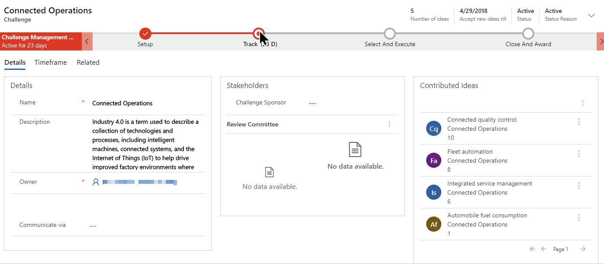

# Work with business processes

Business processes help everyone follow best practices, even for situations that don't occur very often. Where available, business processes provide a step-by-step timeline for the stages of a process at the top of the relevant record. You open the menu for the active stage, enter each field of required and business-critical data, and then select the next stage when you're ready to work with it. Some business processes can be completed in the time it takes to make a single phone call, while others might take several weeks.

As you work on a new customer record, the business process flow helps you see each step that you need to take to create the new record and fill out the required information according to your organizations business process. 

> [!div class="mx-imgBorder"]
> 

The process bar can also be docked to the right side of the screen for easy reference as you work with a customer record. 

> [!div class="mx-imgBorder"]
> 
 
  
 
## What if your business processes looks different from these examples?  

The system comes with business processes for common tasks. However, most organizations customize these processes to match the way they do things. Or, you might have added processes to the system that have been customized for your industry or business goals. In other words, what you see here may not exactly match the process bars you see on your system. But regardless, the process bars work the same for everyone. You enter data in the fields, and then move the customer to the next stage.

For more information on to how to apply custom business logic with business rules and flows, see [Apply custom business logic with business rules and flows in model-driven app](https://docs.microsoft.com/en-us/powerapps/model-driven-apps/guide-staff-through-common-tasks-processes).
