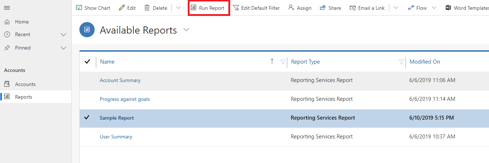
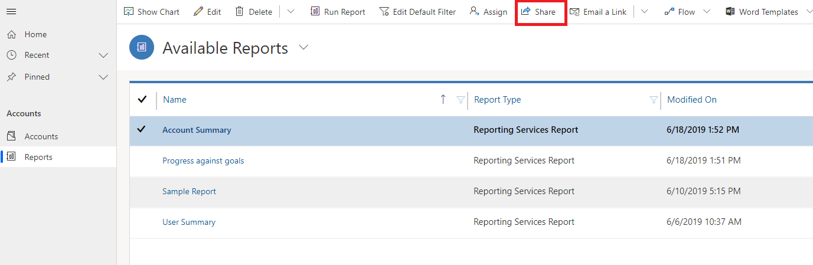
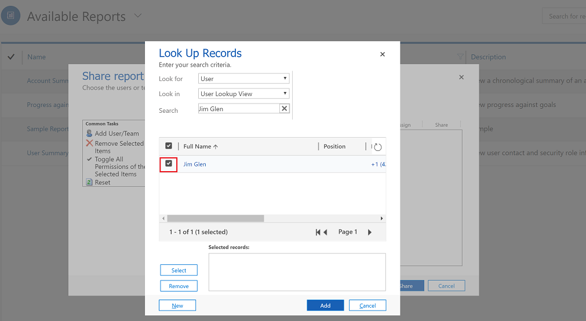
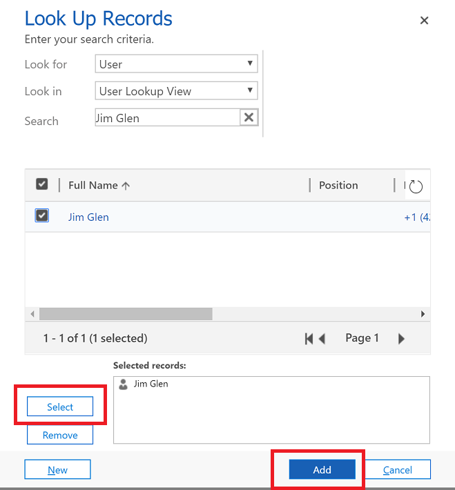
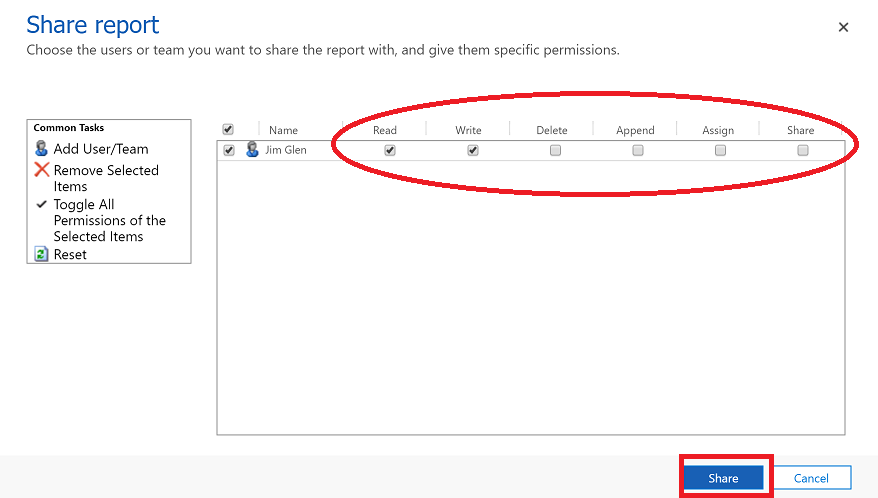
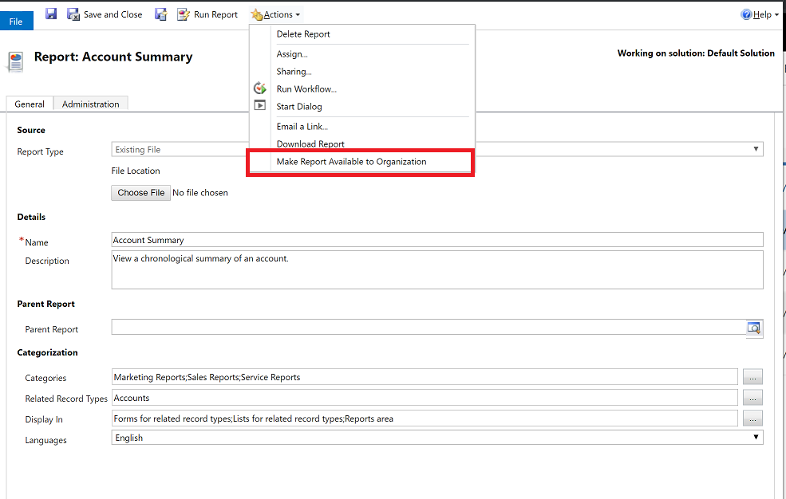

# Work with reports

Reports help you monitor your progress towards your business goals by helping you see how you’re doing. You can also track trends - which can give you an advantage over your competitors.  

The reporting features needs to be enabled for your model-driven app for you to see the reports area on the left navigation pane. More information, see [Add reporting features to your model-driven app](/maker/model-driven-apps/add-reporting-to-app).

  
## Run a report  
  
1. From the left navigation pane, select the reports area. 
2. Choose the report you want > **Run Report**.  
  
   > [!NOTE]
   >  In **Report Viewer** dialog box, you can leave the search criteria as is, or change it as needed.  
   
   > [!div class="mx-imgBorder"]
   > 
 
  
## Share a report with other users or teams    

1. From the left navigation pane, select the reports area.  
2. In the list of reports, select the report you want to share.  
3. On the command bar, select **Share**.

   > [!div class="mx-imgBorder"]
   > 
  
4. On the **Share Report** dialog box, select **Add User/Team**.    
5. In the **Look Up Rows** dialog box, find the users or team row that you want to share the report with, and select the check box next to the row.

   > [!div class="mx-imgBorder"]
   > 

6. Choose **Select** to add the user or team row to the **Selected rows** box and then select **Add**.

   > [!div class="mx-imgBorder"]
   > 
  
7. In the **Share Report** dialog box, select the type of share access that you want. The available permissions are: Read, Write, Delete, Append, Assign, or Share. This will add the user or team row to the **Selected rows** box.

   > [!div class="mx-imgBorder"]
   > 
  

## Share a report with your organization (for admins)
 If the report would be useful for all users, make it available to the organization.  

1. From the left navigation pane, select the reports area.  
2. In the list of reports, select the report you want to share.  
3. On the command bar, select select **Edit**.  
4. On the **Actions** menu, select **Make Report Available to Organization**.  
  
   > [!div class="mx-imgBorder"]
   > 

## Download a report

1. From the left navigation pane, select the reports area. 
2. In the list of reports, select the report you want to share.  
3. On the command bar, select select **Edit**.  
4. On the **Actions** menu, select **Download Report**.  
The RDL file contains the fetchXML that the report is based on.
5. Open the report once the download is complete.

### See Also

[Create a report using the Report Wizard](create-report-with-wizard.md)

[Add a existing report](add-existing-report.md)

[Edit report filter](edit-report-filter.md)

[ Troubleshoot problems with data not displaying in a report ](troubleshoot-reports.md)

[!INCLUDE[footer-include](../includes/footer-banner.md)]
