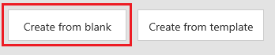
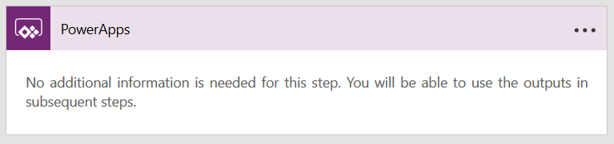
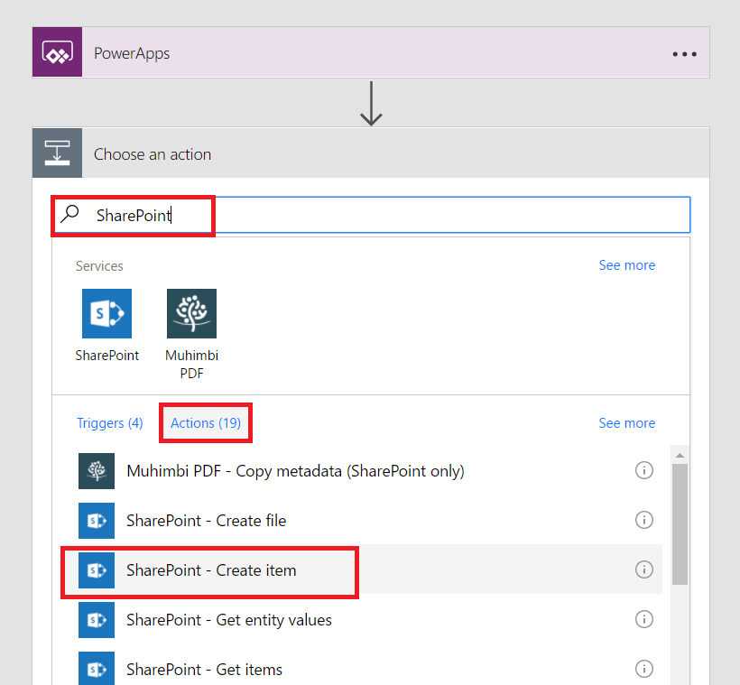
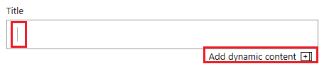
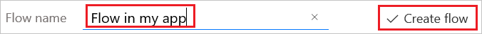

# Start a flow in an app
You can use Microsoft Flow to create logic that performs one or more tasks when an event occurs in an app. For example, configure a button so that, when a user selects it, an item is created in a SharePoint list, an email or meeting request is sent, a file is added to the cloud, or all of these. You can configure any control in the app to start the flow, which continues to run even if you close PowerApps.

## Prerequisites

* [Sign up](signup-for-powerapps.md) for PowerApps, and then follow either of these steps:

  * In the [Windows Store](http://aka.ms/powerappsinstall), install PowerApps Studio for Windows, open it, and then sign in by providing the same credentials that you used to sign up.
  * In [powerapps.com](http://web.powerapps.com), open PowerApps Studio for web by clicking or tapping **New app** in the lower-left corner.
* Learn how to [configure a control](maker/add-configure-controls.md).

## Create a flow
1. Sign in to [powerapps.com](http://web.powerapps.com), and then select **Flows** in the left navigation bar.

2. On the **My Flows** page, select **Create from blank**.

    

    **PowerApps** is added as the default trigger.

    

3. Select **New step**, and then select **Add an action**.

    

4. In the box that says **Search all services and actions**, specify an action for your flow, as in this example:

   1. Type **SharePoint** in the box, and then select **SharePoint - Create item** in the list under **Actions**.

       

   2. If prompted, provide credentials to connect to SharePoint.

   3. In the **Site Address** box, type or paste the URL of a SharePoint Online site that contains a list.

       > [!NOTE]
> Specify the URL for the site not including the list.

   4. In the **List Name** box, select the list that you want to use.

   5. Click or tap the **Title** box, and then select **Add dynamic content**.

       

   6. In the list of parameters, select **Ask in PowerApps**.

       

5. (optional) Specify one or more additional actions, such as sending approval mail to an address that you specify or creating a related entry in another data source.

6. Near the top of the screen, type or paste a name for your flow, and then select **Create flow**.

    

## Add a flow to an app
1. In PowerApps, select **New** in the **File** menu.

2. On the **Blank app** tile, select **Phone layout**.

3. Add a **[Text input](controls/control-text-input.md)** control, and name it **RecordTitle**.

4. Add a **[Button](controls/control-button.md)** control, and move it under **RecordTitle**.

5. With the **[Button](controls/control-button.md)** control selected, select **Flows** on the **Action** tab.

    

6. In the pane that appears, select the flow that you created in the previous procedure.

    > [!NOTE]
> If the flow that you created isn't available, confirm whether PowerApps is set to the environment in which you created the flow.

    

7. In the formula bar, type or paste **RecordTitle.Text)** at the end of the formula that's been automatically added.

    

## Test the flow
1. Open Preview by pressing F5 (or by selecting the arrow near the upper-right corner).

    

2. Type or paste text in **RecordTitle**, and then click or tap the **[Button](controls/control-button.md)** control.

    A SharePoint item is created in the list you specified with the text you specified as the title. If the list was open when the flow ran, you might need to refresh your browser window to show the changes.
